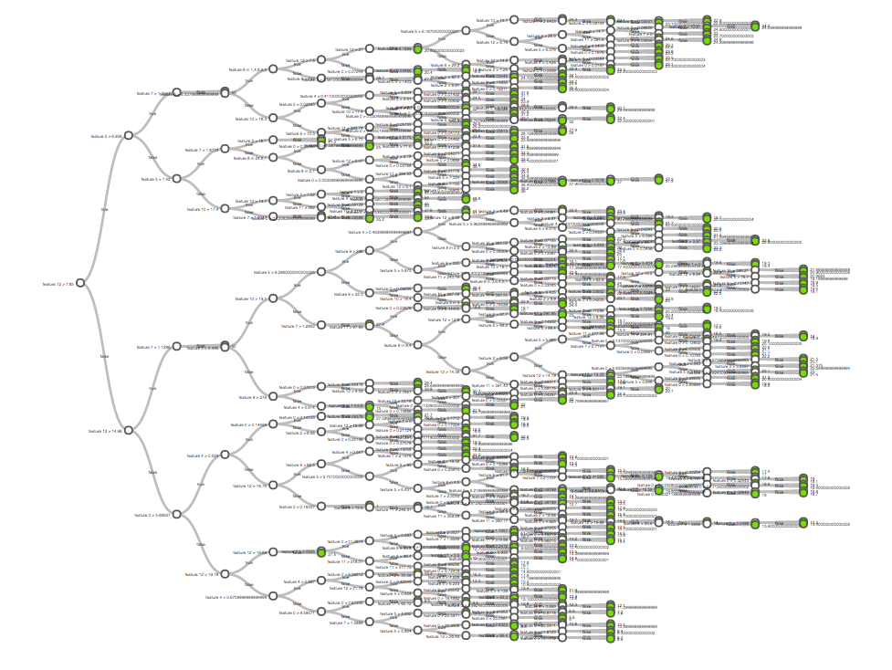

# PredictionIO template: DecisionTree with feature importance

## Overview
An engine template is an almost-complete implementation of an engine. In this Engine Template, we have integrated Apache Spark MLlib's Decision Tree algorithm by default.
The default use case of this regression Engine Template is to predict the price of the [Boston Housing dataset](https://archive.ics.uci.edu/ml/datasets/Housing).
You can customize it easily to fit your specific use case and needs.

We are going to show you how to create your own regression engine for production use based on this template.

## Usage

### With docker:

The best way to get started with predictionio is by using docker. 

#### From our image

```
docker run -ti --dns=8.8.8.8 -p 9000:9000 -v /pathTo/template-decision-tree-feature-importance:/MyRegression ants/predictionio:v0.9.1 bash
```

#### Building the docker image

Following the steps of [mingfang](https://github.com/mingfang/docker-predictionio):

```
git clone https://github.com/mingfang/docker-predictionio.git
cd docker-predictionio
./build
./shell
```
#### Once in the predictionio container

```
runsvdir-start&
```

to start all the services.

You can check the status by running (if you have an error retry, it takes time to start all the services):
```
pio status
```

## Download Template
    
```
cd MyRegression
```

## Generate an App ID and Access Key
Let's assume you want to use this engine in an application named "MyApp1". You will need to collect some training data for machine learning modeling. You can generate an App ID and Access Key that represent "MyApp1" on the Event Server easily:
```
pio app new MyApp1
```
If the app is no yet created, you should find the following in the console output:
```
...
[INFO] [App$] Initialized Event Store for this app ID: 1.
[INFO] [App$] Created new app:
[INFO] [App$]       Name: MyApp1
[INFO] [App$]         ID: 1
[INFO] [App$] Access Key: ZON0FP6gdLeXxg1g7O1E9TPXIOxQMIngIr0LWQUC5Tv0utyyGwvs1AmG6DyDchLO
```

Take note of the Access Key and App ID. You will need the Access Key to refer to "MyApp1" when you collect data. At the same time, you will use App ID to refer to "MyApp1" in engine code. If the app exists already use `pio app list` to return a list of names and IDs of apps created in the Event Server.


## Collecting Data

Here are the features of the boston housing dataset:

    1. CRIM      per capita crime rate by town
    2. ZN        proportion of residential land zoned for lots over 
                 25,000 sq.ft.
    3. INDUS     proportion of non-retail business acres per town
    4. CHAS      Charles River dummy variable (= 1 if tract bounds 
                 river; 0 otherwise)
    5. NOX       nitric oxides concentration (parts per 10 million)
    6. RM        average number of rooms per dwelling
    7. AGE       proportion of owner-occupied units built prior to 1940
    8. DIS       weighted distances to five Boston employment centres
    9. RAD       index of accessibility to radial highways
    10. TAX      full-value property-tax rate per $10,000
    11. PTRATIO  pupil-teacher ratio by town
    12. B        1000(Bk - 0.63)^2 where Bk is the proportion of blacks 
                 by town
    13. LSTAT    % lower status of the population

Most of the features are continuous execpt CHAS and RAD. We can specify this in `data/learning_metadata.csv` which contains:

```
co,co,co,ca2,co,co,co,co,ca25,co,co,co,co
```

**We've implemented a `readFromDbAndFile` in `DataSource` enabling you to load big chunks of data from a file**.
The data contained in `data/learning.csv` will be read directly from the file during the traing while `data/learning_events.csv` can be loaded as events using:

```
$ python data/import_eventserver.py --access_key ZON0FP6gdLeXxg1g7O1E9TPXIOxQMIngIr0LWQUC5Tv0utyyGwvs1AmG6DyDchLO

7 events are imported.
```

You can do the learning with:

```
pio build --verbose
pio train
```

This what you should see:

```
Read 0 labeled Points from db.
Read 499 labeled Points from file.
Read 385 for training.
Read 114 for testing.

Pearson correlation:
0.888772406471315
0 --> 0.6161053850251208
7 --> 0.3906382007374483
2 --> 0.1318489505497093
4 --> 0.08992088305559369
1 --> 0.0856921742934753
6 --> 0.08121969448088352
11  --> 0.06503553234480065
9 --> 0.019383820677064782
3 --> 0.0
8 --> -0.009703859055510834
10  --> -0.1209922163655196
5 --> -0.16274805206199028
12  --> -0.18640051368107574
```

These are the pearson coefficient and the feature importances classified by order (one should find a way to give the names directly, but we'll do that soon).
 
After the learning you can use you prediction service as usual. You can **visualize the decision tree** by reading the file `data/decisionTree.json`.
Checkout the `/viz` directory for the code.


